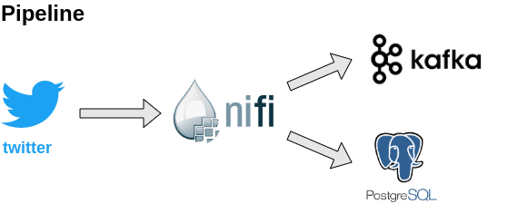

# Ingestão de dados do twitter com Nifi, Kafka e Postgres

### Etapas
1. Extrair os dados sobre covid do twitter
2. Disponibilizar os dados no tópico do kafka
3. Consumir o tópico e armazenar no banco de dados postgres

### Ferramentas
- Apache Kafka: é uma plataforma distribuída de código aberto de streaming de eventos, utilizada para pipelines de dados de alto desempenho, análise de streaming, integração de dados e aplicativos de missão crítica.
- Apache Nifi: é uma ferramenta de código aberto para processar e distribuir dados. 
- Apache Zookeeper: é um serviço centralizado para manter informações de configuração, nomenclatura e fornecer serviço de sincronização distribuída entre os serviços. É utilizado por ambos, kafka e Nifi.
- Postgres: banco de dados relacional.